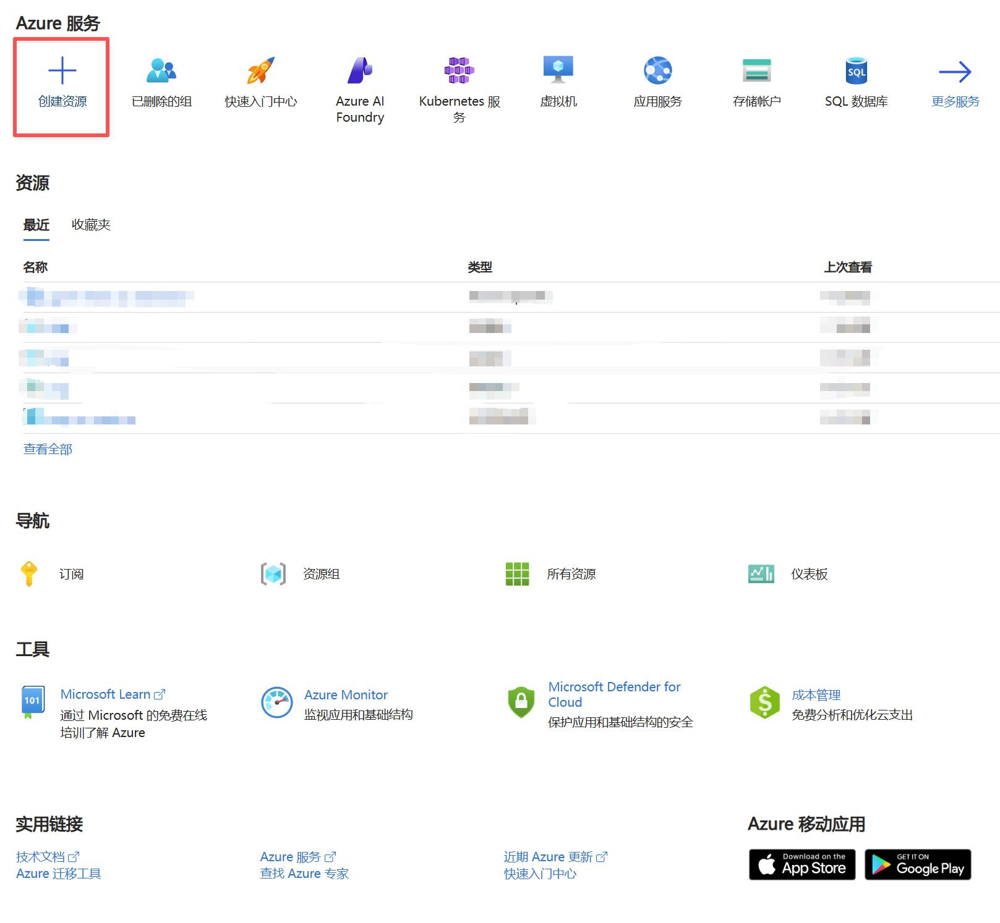
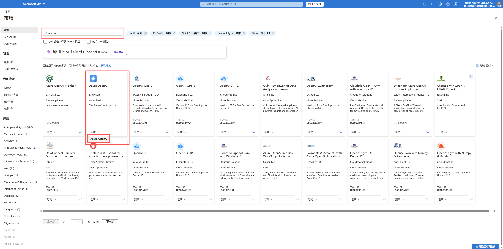
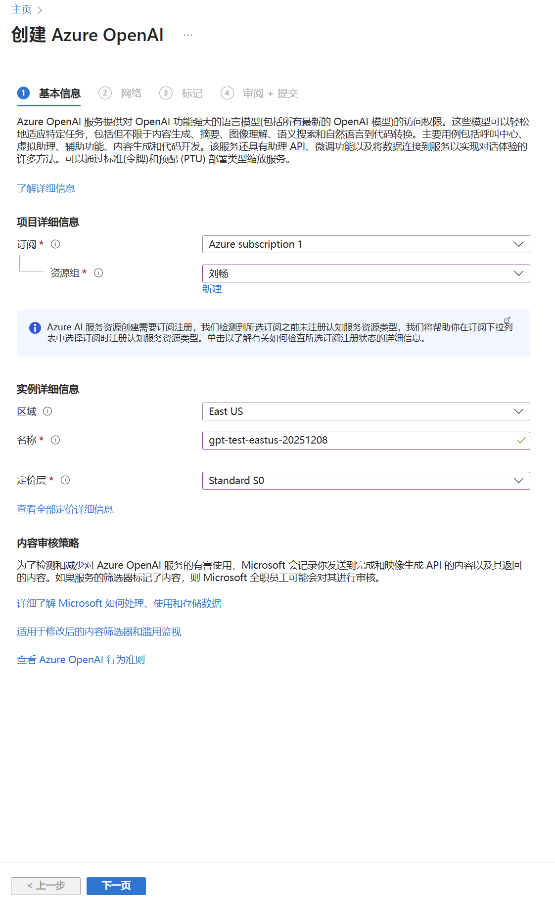
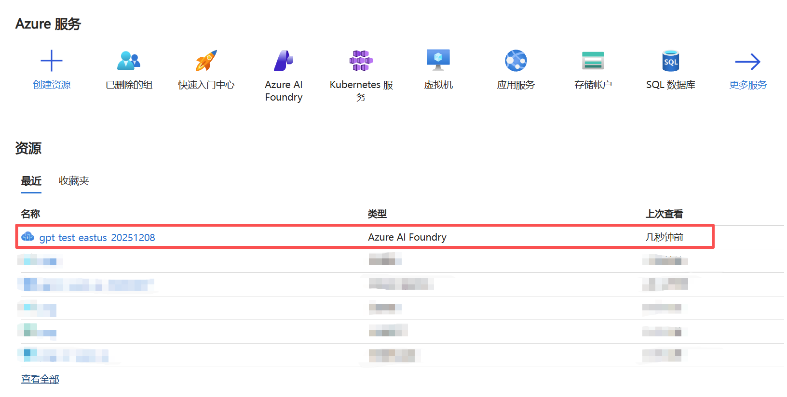
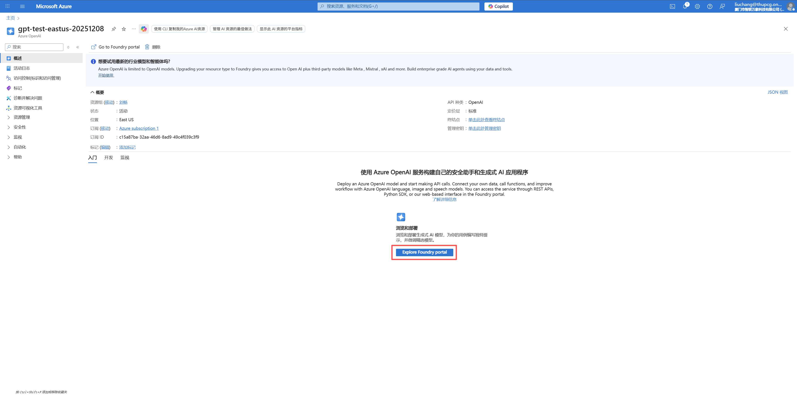
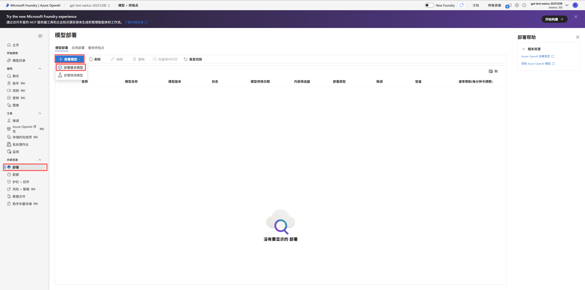
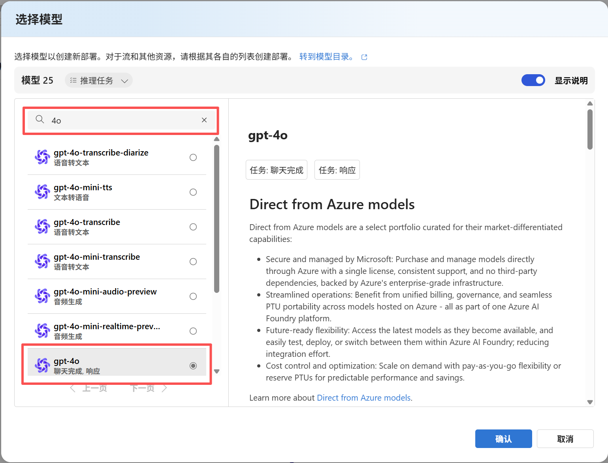
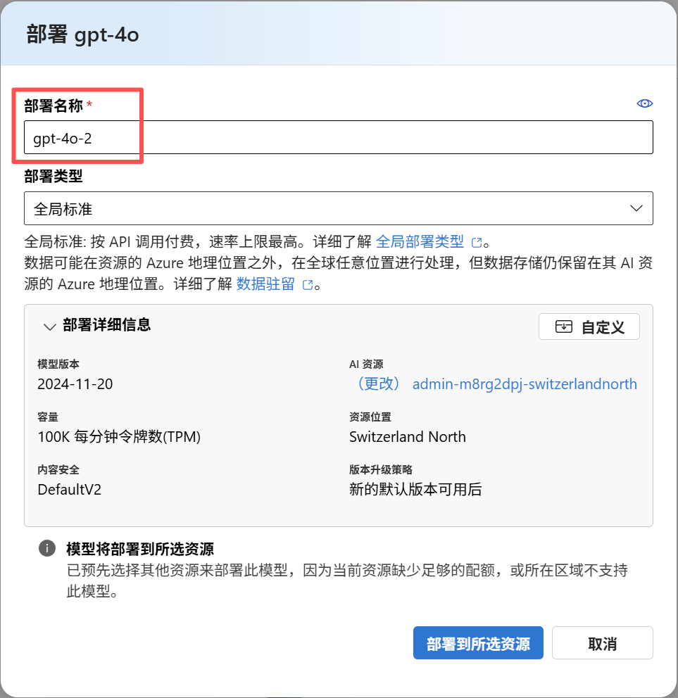
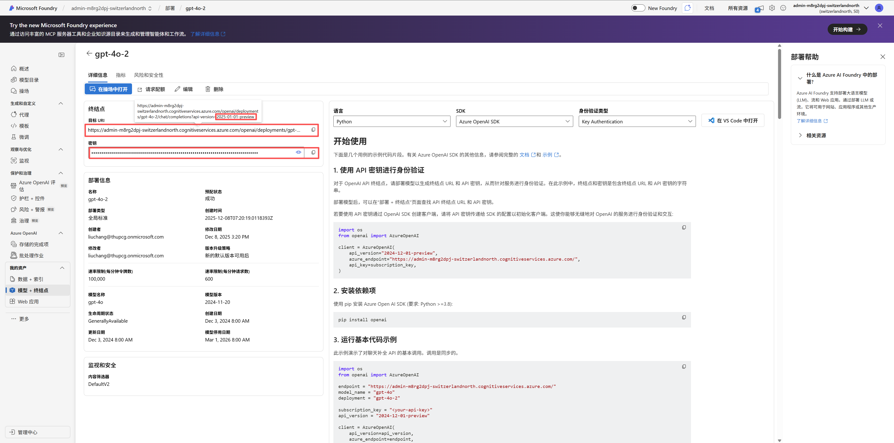

## 创建资源
1. 打开 Azure AI 平台，创建一个新的计算节点。
网址：https://azure.microsoft.com/zh-cn/overview/ai-platform/
2. 点击下方图片中所示“创建资源”

3. 在弹出的页面中，搜索“openai”，选择“Azure OpenAI”，点击“创建”，选中弹出的“Azure OpenAI”。

4. 资源组”选择自己的姓名，区域随意选择（不同区域的服务可能有不同），设置好实例名称，定价层只能选择一个“Standard S0”。设置完成后下一步。 

5. 在“网络”选项卡和“标记”选项卡中，都不需要进行任何设置，直接下一步。 到“审阅+提交”选项卡后，稍等一下，等系统验证通过后（大约10秒），点击右下角“创建”按钮即可。部署需要一段时间，耐心等待一下。 
6. 完成部署后，Azure的首页“资源”中会多出这个新创建的资源节点。点击该节点，进入管理界面。

7. 点击打开页面中的“Explore Foundry portal”。

8. 点击打开页面中左侧的“部署”，然后点击新页面中的“部署模型”-“部署基础模型”。

9. 在弹出的对话框中，搜索你想要的模型，选中该模型，然后点击“下一步”。

10. 设置部署名称，然后点击“部署到所属资源”，并等待部署完成。（也许需要较长的部署时间）

11. 在打开的页面中，左侧的“终结点”的“目标Url”和“秘钥”是调用该模型时需要用到的“api_key”和“azure_endpoint”。目标Url最后的“api-version=xxx”是调用时的“api_version”。

12. 之后，在“Explore Foundry portal”的“部署”页面中，应该也能看到刚才部署的模型。如果不行，可以尝试刷新页面。还不行，可以尝试再次部署一个模型（它有可能两个一次性出现）。